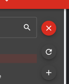

# Red Five Standing By


A Redis dashboard that aims to be easy on the eyes, and easy to use.

## Highlights

Browser based dashboard powered by Node that lets you see into your Redis instances.

- Key Management
- CLI
- Monitoring

## Usage

```shell
npx @caldwell-619/red-five

# or to install globally ( not recommended )

npm i -g @caldwell-619/red-five
red-five
```

After running the above command, you can open the browser to `http://localhost:5001/` to see the dashboard.

## Options

There are currently 2 optional flags you can pass to configure the behavior.

| Name         | Flag                | Default  | Description                                                                                                                       |
| ------------ | ------------------- | -------- | --------------------------------------------------------------------------------------------------------------------------------- |
| Log Level    | `--log-level debug` | `silent` | Controls what level of logging is done while the app is running. Silent is no logging, debug is thorough logging on every request |
| Open browser | `-o` or `--open`    | `false`  | If present, your system default browser will be opened to the running app after 4 seconds                                         |

## Goal

The goal is to be simple. This doesn't try to do too much, or is a complete solution. It's designed to be a simple, easy to use monitoring tool for inspecting you Redis instances.

If you'd like to see something new, [submit an issue](https://github.com/christopher-caldwell/red-five/issues/new)!

## Connections

If you do not have any configured connections, you will be redirected to a page to create one.

### Creating

Click the small plus in the top right hand corner to open the dialog. The host in this case is just the domain, **not the protocol** such as `http`. Example: `localhost` or `redis.io`

### Switching

To switch connections, click the top left drop down to open your connection manager.

Choose the checkbox of the connection you'd like to "make active". All operations will now be directed at this instance.

### Auth

Currently, only auth strings are supported for auth. This was all I needed, but feel free to upvote [this issue](https://github.com/christopher-caldwell/red-five/issues/7) if you'd like more options.

## Keys

The is the core feature. Seeing keys, values, and TTLs. You can also edit TTLs, and the value of said key.

### Viewing

You can view the key in parsed JSON as well as it's raw string.

The default is just as it's stored, but you can attempt to view it in parsed, highlighted JSON.


### Adding new keys

On the left side explorer, you can hover or click on the circular button to reveal a small menu. In this menu, you can refresh or add a new key.



> :warning: Currently the only supported key type is a string.

### Remove Keys

You can of course remove the key with the lower left trash button

## CLI

Some people prefer the CLI to the actual GUI. Why not both? A built in CLI that's sending commands to your desired instance.

### Persisting Messages

There is a switch at the top right corner that will begin to persist the responses to local storage so they aren't lost on page change or refresh.

There are 2 options for persisting that can be found on the settings page.

You can choose how many messages are persisted before being deleted, and you can choose the method of removal.

#### Wipe

Once the messages reach number x, they are completely removed. You start over at 0 persisted messages, and the window will be reset.

#### Pop as you go

When messages reach number x, the oldest message is removed to make way for the new one. This will keep your persisted messages at number x until you either stop persisting or change the setting.

#### Behavior when switching

Whenever you turn off message persisting, the stored messages will be erased. If you don't like that or want some other behavior, [submit an issue](https://github.com/christopher-caldwell/red-five/issues/new)!

## Monitoring

To monitor you instance in real time, go to `/monitor`, or choose the monitor button on the top right nav.

Slide the toggle to begin monitoring

> :warning: Monitoring will reduce the performance of the instance.

If you leave this page, you will still be monitoring that instance until you turn it off, or kill the server.
