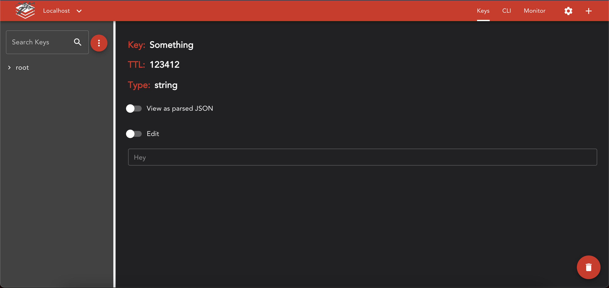
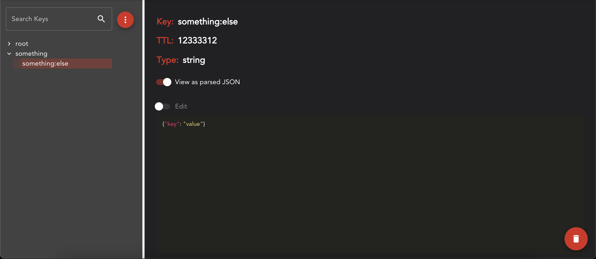
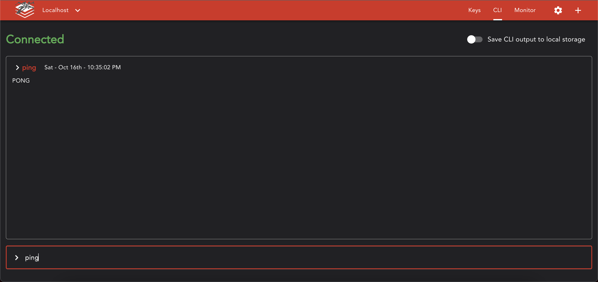
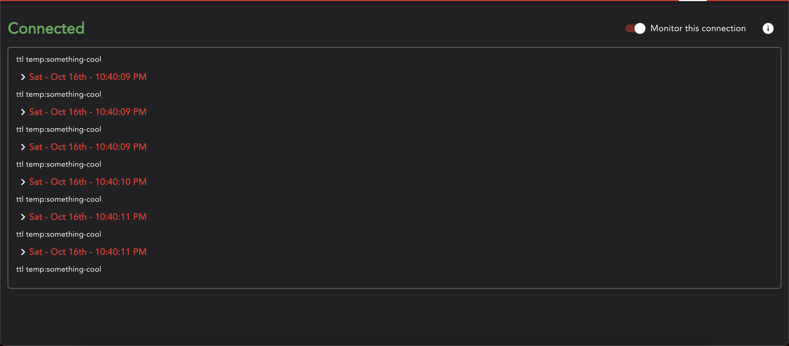
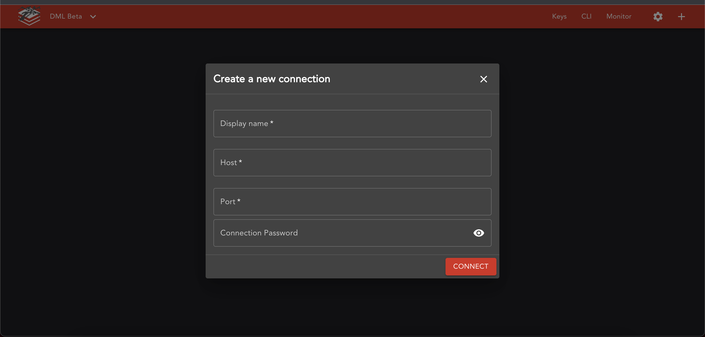

# Screen Shots

This collection is an effort to showcase what the running application looks like.

## Viewing a Simple Key

This is not JSON, it's just a plain value.

## Viewing a JSON Key

This is JSON, and it's shown with the parsed option turned on.

## CLI

You can run a subset of commands here, mostly basic things like TTL, get, set etc. 

Complex commands like `mset` or any ranges are not yet supported

## Monitoring

This is not currently supported with localhost. For some reason, it throws an error when trying to monitor local host. I have an issue setup [here](https://github.com/christopher-caldwell/red-five/issues/22) to track that progress.

## Creating a New Connection

Creation is done in a dialog.

